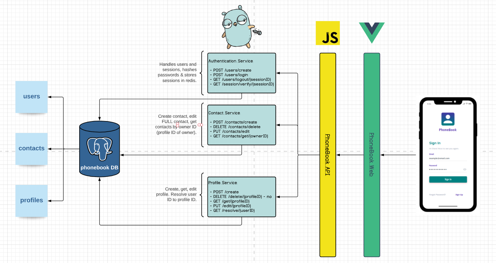

# Телефонен Указател

## Проект по Уеб Технологии - Екип 14, Ис, 3 курс

## Описание на Заданието

- Predictive search
- Няколко номера към едно име
- Мета информация (e.g. address)
- Добавяне, изтриване, сливане на контакти

## Архитектура

## Хранилище

1. PSQL

   - Съдържа таблици:
     - **users**,
     - **profiles**,
     - **contacts**.

2. Redis

   - Съхранява сесиите на потребителите.

3. [Създаване на хранилището](https://github.com/webtech-fmi/phonebook/storage) - чрез docker-compose.

## Бекенд

1. [Golang](https://github.com/webtech-fmi/phonebook/backend/go)

   - **authentication-service** - Създаване и използване на потребители и сесии.
   - **profile-service** - Създаване и използване на профили на потребителите на платформата.
   - **contact-service** - Създаване и използване на контакти, принадлежащи на указателите на потребителите.

2. [JavaScript](https://github.com/webtech-fmi/phonebook/backend/js)

   - **phonebook-api** - Единствена точка за достъп до бекенд от фронтенд.

## [Фронтенд](https://github.com/webtech-fmi/phonebook/frontend)

- **Vue3.js**

- Основни компоненти на сайта

  - **Login.vue** - начална страница(когато не си влезнал в сайта) и място за логинване

  - **SignUp.vue** - страница за създаване на нов потребител

  - **Contact.vue** - страница, която показва информация за потребителя или неговите контакти

  - **AllContacts.vue** - страница със списък от всички контакти на потребителя с опция да се маркират любими

  - **AddContact.vue** - страница в която потребителя може да си добави нов контакт

  - **HamburgerMenu.vue** - компонент, който присъства на множество места в сайта, като представлява странично меню от което потребителя може да навигира къде се намира

  - **Favourites.vue** - страница в която потребителя може да намери всички "любими" контакти

- Използвани библиотеки

  - **element-plus** - библиотека, използвана за дизайн

  - **axios** - библиотека за извършване на HTTP заявки

  - **eslint** - библиотека за статичен анализ на код с цел за намиране на потенциални проблемни
